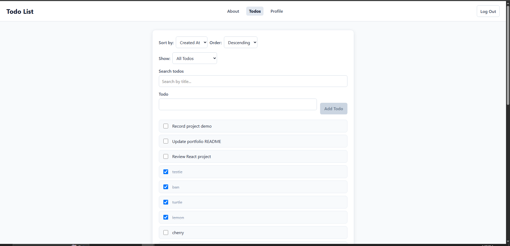
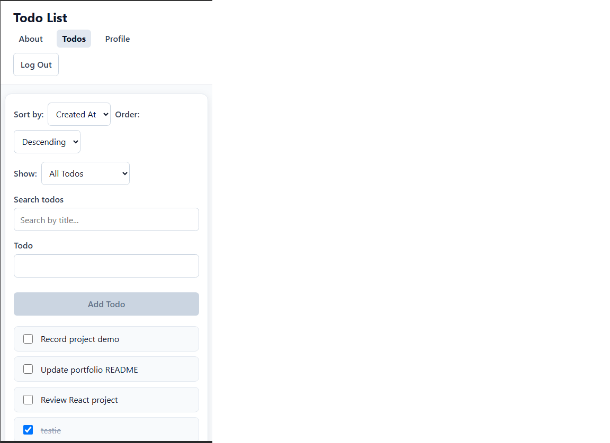

# Todo List

A React todo application built throughout the Code the Dream React course.

The project started as a basic todo list and grew into a multi-page application with authentication, filtering, sorting, editing, completion tracking, profile statistics, validation, and responsive styling.

## Features

- Log in and log out
- Add new todos
- Edit existing todos
- Mark todos as completed or active
- Delete todos
- Search todos by title
- Sort todos by title or creation date
- Sort in ascending or descending order
- Filter by all, active, or completed todos
- View todo statistics on the profile page
- Responsive layout for smaller screens
- Input validation and maximum title lengths
- User-friendly error messages

## Screenshots

### Desktop



### Mobile



## Technologies Used

- React
- React Router
- Vite
- JavaScript
- CSS Modules
- Context API
- `useReducer`
- `useMemo`
- `useCallback`
- Custom React hooks
- Fetch API
- ESLint

## What I Learned

While building this project, I practiced breaking a React application into reusable components and managing increasingly complex application state.

I used React Router to create multiple pages, Context to share authentication state, and `useReducer` to manage todo state and actions. I also added server-side sorting and searching, debounced search input, optimistic todo updates, and status filtering through URL search parameters.

For the final version, I used CSS Modules to give components locally scoped styles and created consistent layouts for the todo, login, profile, and about pages.

## Design Decisions

I used CSS Modules so styles stay scoped to individual components and do not accidentally affect other parts of the application.

I kept the layout simple and centered with consistent spacing, readable typography, and clear form controls. I also added responsive styles so the application remains usable on smaller screens without horizontal scrolling.

For state management, I used React Context and `useReducer` as the application became more complex, which helped keep todo and authentication state organized.

## Security and Validation

The application includes several frontend security and validation practices:

- React's normal JSX escaping is used instead of inserting raw HTML
- Todo titles cannot be empty
- Todo titles have a maximum length
- Search input has a maximum length
- Authentication and todo errors display user-friendly messages rather than internal technical details
- Authenticated API requests use the application's CSRF token and credentials

## Challenges

One challenge was managing todo state as the application gained more functionality. Moving the todo state into a reducer made the different loading, success, error, filtering, and update states easier to organize.

Another challenge was keeping filtering and sorting synchronized with API requests. I used `URLSearchParams` and a debounced search value so that the application could request filtered and sorted data without sending a request for every individual keystroke.

Styling was also added near the end of the project. I used CSS Modules so styles remain scoped to their components and created reusable styles for form controls and content pages.

## Prerequisites

- Node.js
- npm
- Git

## Installation

Clone the repository:

```bash
git clone https://github.com/sullenestbody/todo-list.git
cd todo-list
```

Install dependencies:

```bash
npm install
```

Create a `.env` file in the project root and add:

```env
VITE_TARGET=https://ctd-learns-node-l42tx.ondigitalocean.app
```

Start the development server:

```bash
npm run dev
```

Then open the local URL shown by Vite in your browser.

## Available Scripts

### `npm run dev`

Starts the Vite development server.

### `npm run build`

Creates a production build of the application.

### `npm run preview`

Runs the production build locally so it can be tested before deployment.

### `npm run lint`

Runs ESLint to check the project for code quality issues.

## Future Improvements

Possible future improvements include:

- Improved loading indicators
- More detailed validation feedback
- Additional accessibility testing
- Dark mode
- Due dates and priorities
- Deployment to a public hosting service

## License

This project is licensed under the MIT License.

## Contact

GitHub: https://github.com/sullenestbody
